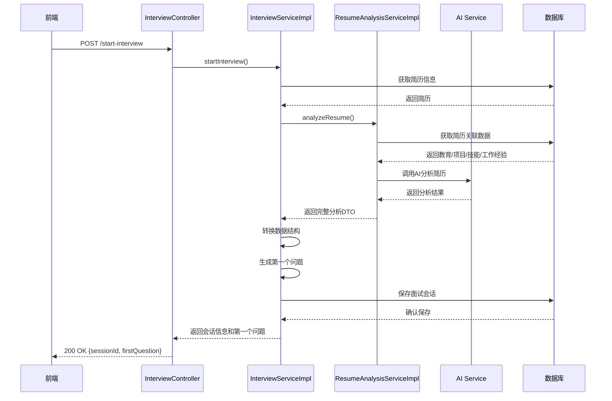

# 简历分析模块与面试系统集成方案

## 1. 集成目标

将ResumeAnalysisService的深度简历分析能力无缝集成到InterviewService中，实现：
- 复用简历分析结果，避免重复AI调用
- 提供更加个性化和针对性的面试问题
- 提升面试过程的用户体验
- 确保系统稳定性和性能

## 2. 技术方案设计

### 2.1 核心集成点

修改`InterviewServiceImpl`的`startInterview`方法，将原来的`extractTechItemsAndProjectPoints`方法调用替换为`ResumeAnalysisService.analyzeResume`方法调用。

### 2.2 数据结构映射

| ResumeAnalysisDTO字段 | InterviewSession使用 | 说明 |
|----------------------|---------------------|------|
| technicalAnalysis.skillProficiency | techItems | 转换为技能列表 |
| projectAnalysis.projects | projectPoints | 转换为项目点列表 |
| interviewQuestions | 优先使用预设问题 | 利用AI生成的面试问题库 |
| experienceLevel | interviewState | 设置初始深度级别 |

### 2.3 集成流程



## 3. 用户体验优化

### 3.1 性能优化

1. **缓存机制**
   - 为简历分析结果添加缓存，避免短时间内重复分析同一简历
   - 缓存时间：30分钟，可配置

2. **异步处理**
   - 对于复杂的简历分析，考虑异步处理
   - 提供进度反馈，显示"正在分析简历..."

3. **预分析**
   - 在用户准备面试前，可提前触发简历分析

### 3.2 功能优化

1. **问题多样性**
   - 结合ResumeAnalysisService生成的多维度问题（技术、项目、行为等）
   - 根据候选人技能熟练度调整问题深度

2. **个性化体验**
   - 利用分析结果中的候选人优势和待提升项，调整面试重点
   - 面试过程中引用候选人实际项目经验

3. **反馈机制**
   - 提供实时进度提示
   - 面试结束后提供基于分析结果的详细报告

## 4. 代码实现计划

### 4.1 服务注入

在`InterviewServiceImpl`中注入`ResumeAnalysisService`：

```java
@Autowired
private ResumeAnalysisService resumeAnalysisService;
```

### 4.2 数据转换工具

创建工具方法，将`ResumeAnalysisDTO`转换为面试系统所需的数据格式。

### 4.3 修改startInterview方法

替换原有的`extractTechItemsAndProjectPoints`调用，使用`ResumeAnalysisService`的分析结果。

### 4.4 异常处理

添加完善的异常处理机制，确保在简历分析失败时系统仍能正常运行。

## 5. 降级策略

当`ResumeAnalysisService`不可用时，回退到原有的`extractTechItemsAndProjectPoints`方法，确保系统可用性。

## 6. 测试计划

1. 单元测试：验证服务集成和数据转换
2. 集成测试：验证完整的面试流程
3. 性能测试：验证在高负载下的系统表现

## 7. 实施风险

1. **性能风险**：完整的简历分析可能耗时较长，影响用户体验
2. **依赖风险**：增加了对`ResumeAnalysisService`的依赖
3. **数据一致性风险**：两个服务的数据模型可能存在差异

## 8. 缓解措施

1. 实施缓存和异步处理
2. 添加完善的降级策略
3. 确保数据模型的兼容性

## 9. 验收标准

1. 面试系统能够成功调用简历分析模块
2. 生成的面试问题更加个性化和针对性
3. 用户体验得到明显提升
4. 系统在各种场景下保持稳定
5. 性能指标满足要求