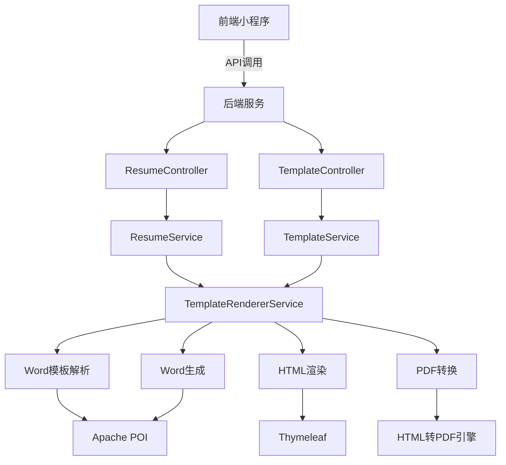
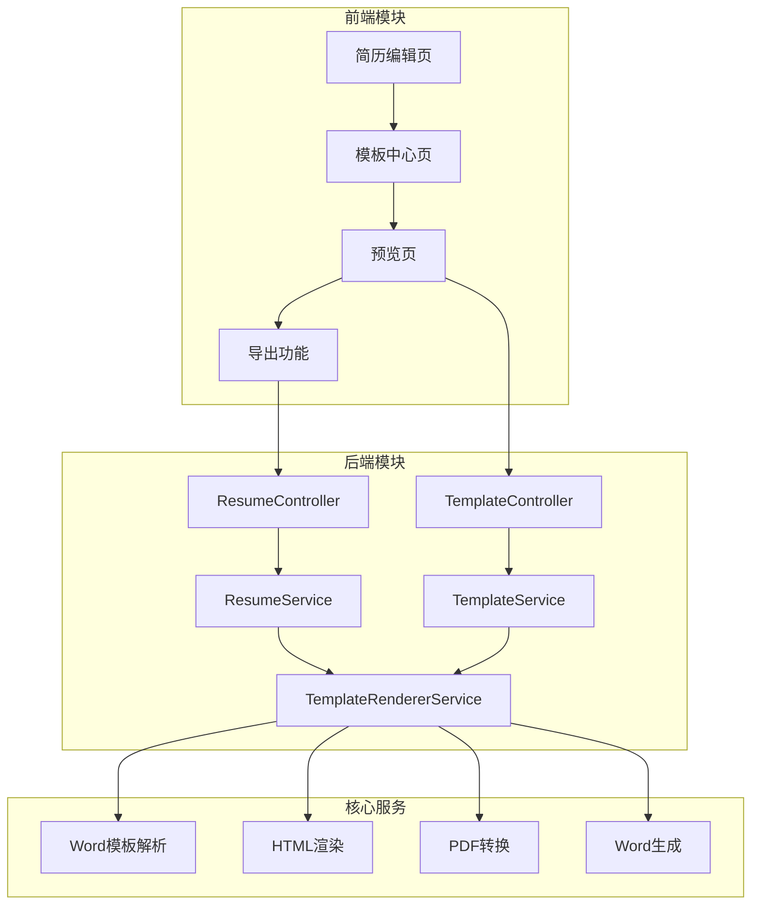
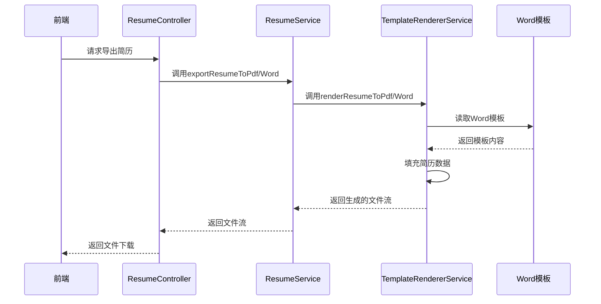

# 简历模板渲染与导出功能设计

## 整体架构图

## 分层设计

### 1. 表现层
- **前端小程序**：负责用户交互、数据展示和API调用
  - 简历编辑页：收集用户输入的简历数据
  - 模板中心页：展示可用模板
  - 预览页：显示渲染后的简历内容
  - 导出功能：调用后端API导出文件

- **后端控制器**：处理HTTP请求，调用业务服务
  - ResumeController：处理简历相关操作
  - TemplateController：处理模板相关操作

### 2. 业务层
- **ResumeService**：简历业务逻辑
  - 简历数据管理
  - 调用模板渲染服务
  - 文件导出功能

- **TemplateService**：模板管理逻辑
  - 模板查询和管理
  - 权限检查

- **TemplateRendererService**：核心渲染服务
  - Word模板解析
  - HTML生成
  - 数据填充
  - PDF和Word导出

### 3. 数据访问层
- Repository接口：负责数据持久化

## 模块依赖关系

## 接口契约定义

### 前端到后端接口
1. **获取模板列表**
   - URL: `/api/template/all`
   - 方法: GET
   - 返回: 模板列表

2. **从Word模板生成HTML**
   - URL: `/api/template/{id}/generate-html`
   - 方法: GET
   - 返回: HTML内容

3. **导出为PDF**
   - URL: `/api/resume/export/pdf`
   - 方法: GET
   - 参数: resumeId
   - 返回: PDF文件流

4. **导出为Word**
   - URL: `/api/resume/export/word`
   - 方法: GET
   - 参数: resumeId
   - 返回: Word文件流

### 内部服务接口
1. **TemplateRendererService接口**
   - `generateHtmlFromLocalWordTemplate(Template template)`: 从本地Word模板生成HTML
   - `renderResumeToPdf(Template template, Resume resume)`: 将简历渲染为PDF
   - `renderResumeToWord(Template template, Resume resume)`: 将简历渲染为Word
   - `formatResumeData(Template template, Resume resume)`: 格式化简历数据

## 数据流向图

## 异常处理策略
1. **模板不存在**：返回404错误，提示模板不存在
2. **渲染失败**：返回500错误，记录详细错误日志
3. **参数错误**：返回400错误，提示参数不正确
4. **文件格式错误**：返回400错误，提示文件格式不支持
5. **权限不足**：返回403错误，提示无权限访问

## 设计原则
1. **高内聚低耦合**：各模块职责清晰，减少模块间依赖
2. **可扩展性**：支持后续添加更多模板和格式
3. **复用性**：充分利用现有代码，避免重复开发
4. **性能优化**：避免不必要的文件操作和数据转换