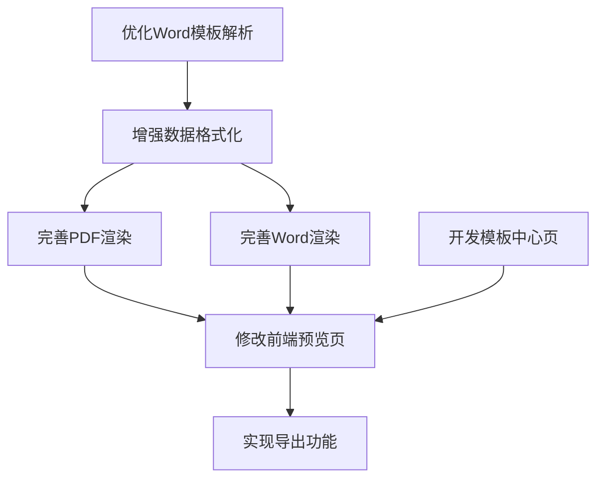

# 简历模板渲染与导出功能任务清单

## 任务依赖图

## 子任务详情

### 任务1: 优化Word模板解析功能
- **任务ID**: T1
- **输入契约**:
  - 现有的TemplateRendererServiceImpl类
  - template_one.docx模板文件
- **输出契约**:
  - 优化后的generateHtmlFromLocalWordTemplate方法
  - 能够保留模板样式的HTML输出
- **实现约束**:
  - 使用Apache POI解析Word文档
  - 确保中文内容正确显示
  - 保留所有样式、格式、表格等元素
- **依赖关系**:
  - 前置任务: 无
  - 后置任务: T2

### 任务2: 增强简历数据格式化
- **任务ID**: T2
- **输入契约**:
  - 现有的formatResumeData方法
  - Resume实体类数据结构
- **输出契约**:
  - 优化后的formatResumeData方法
  - 符合模板要求的数据格式
- **实现约束**:
  - 支持教育经历、工作经历等复杂数据结构
  - 保持数据的完整性和一致性
  - 处理可能为空的数据字段
- **依赖关系**:
  - 前置任务: T1
  - 后置任务: T3, T4

### 任务3: 完善PDF渲染功能
- **任务ID**: T3
- **输入契约**:
  - 现有的renderResumeToPdf方法
  - 优化后的HTML模板
- **输出契约**:
  - 优化后的renderResumeToPdf方法
  - 与模板样式一致的PDF输出
- **实现约束**:
  - 确保PDF格式正确
  - 保持样式一致性
  - 支持中文显示
- **依赖关系**:
  - 前置任务: T2
  - 后置任务: T5

### 任务4: 完善Word渲染功能
- **任务ID**: T4
- **输入契约**:
  - 现有的renderResumeToWord方法
  - Word模板文件
- **输出契约**:
  - 优化后的renderResumeToWord方法
  - 基于模板生成的Word文档
- **实现约束**:
  - 保持模板样式
  - 正确填充数据
  - 支持复杂数据结构
- **依赖关系**:
  - 前置任务: T2
  - 后置任务: T5

### 任务5: 修改前端预览页面
- **任务ID**: T5
- **输入契约**:
  - 现有的view.wxml和view.js文件
  - 后端生成的HTML模板
- **输出契约**:
  - 修改后的预览页面
  - 能够正确显示渲染后的简历内容
- **实现约束**:
  - 使用WebView加载HTML内容
  - 确保样式一致性
  - 提供良好的用户体验
- **依赖关系**:
  - 前置任务: T3, T4, T7
  - 后置任务: T6

### 任务6: 实现前端导出功能
- **任务ID**: T6
- **输入契约**:
  - 修改后的预览页面
  - 后端导出API
- **输出契约**:
  - 支持导出为PDF和Word的功能
  - 正确的文件下载处理
- **实现约束**:
  - 调用后端导出API
  - 处理文件下载和保存
  - 提供导出状态反馈
- **依赖关系**:
  - 前置任务: T5
  - 后置任务: 无

### 任务7: 开发模板中心页面
- **任务ID**: T7
- **输入契约**:
  - 模板列表API
  - 模板预览API
- **输出契约**:
  - 新的模板中心页面
  - 模板选择功能
- **实现约束**:
  - 展示可用模板列表
  - 提供模板预览功能
  - 实现模板选择逻辑
- **依赖关系**:
  - 前置任务: 无
  - 后置任务: T5

## 验收标准

1. **任务1验收**:
   - Word模板能够正确转换为HTML
   - HTML保留了原始模板的所有样式和格式
   - 中文内容显示正常

2. **任务2验收**:
   - 简历数据能够正确格式化
   - 支持所有必要的字段和数据结构
   - 空值处理正确

3. **任务3验收**:
   - 生成的PDF与模板样式一致
   - 所有数据正确填充
   - 中文显示正常

4. **任务4验收**:
   - 生成的Word文档基于模板创建
   - 保持模板样式
   - 数据填充正确

5. **任务5验收**:
   - 预览页面正确显示渲染后的内容
   - 样式与导出文件一致
   - 用户体验良好

6. **任务6验收**:
   - 能够成功导出PDF和Word文件
   - 文件内容和样式正确
   - 导出过程有状态反馈

7. **任务7验收**:
   - 模板中心页面展示所有可用模板
   - 能够预览模板效果
   - 能够选择模板应用到简历